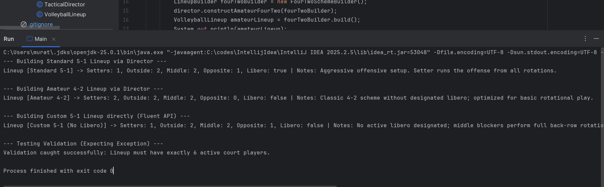

# Volleyball Lineup Builder - SDP Assignment 1

This project is created for the Software Design Patterns course (Assignment 1). It demonstrates how to use the **Builder Design Pattern** to construct complex volleyball tactical lineups step-by-step with fluent API and state validation.

---

##  Project Overview

In volleyball, different tactical schemes (like 5-1 or 4-2) require precise player positions (Setters, Outside Hitters, Middle Blockers, Opposites) and specific rules. Using a standard constructor with many parameters can lead to errors and dirty code.

The Builder pattern solves this problem by separating object construction from its representation, allowing us to create different lineups easily.

---

##  Architecture & Pattern Components

The project follows the standard Builder pattern structure:

- **Product (`VolleyballLineup`)**: Represents final volleyball lineup object containing information about player roles, formation name, libero presence, and tactical notes.
- **Builder Interface (`LineupBuilder`)**: Defines all build steps returning `LineupBuilder` for method chaining (Fluent API).
- **Concrete Builders (`FiveOneSchemeBuilder`, `FourTwoSchemeBuilder`)**: Implements construction steps and validates scheme constraints (e.g. enforcing roster rules and throwing `IllegalStateException` if court players count isn't exactly 6).
- **Director (`TacticalDirector`)**: Defines recipes for constructing standard presets like *Standard 5-1* and *Amateur 4-2*.
- **Client (`Main`)**: Runs demonstration for both predefined director setups, direct custom building via fluent API, and validation testing.

---

##  UML Class Diagram

Below is the PlantUML diagram showing structure of the system:

.png)

---

##  Program Execution & Result

The program demonstrates successful creation of lineups and catching validation exceptions.

---

##  How to Run

1. Clone repository to your local computer.
2. Open project in **IntelliJ IDEA** (or any Java IDE with JDK 17+ support).
3. Navigate to `src/sdp/assignment1/Main.java`.
4. Run `main` method to see execution output in terminal.